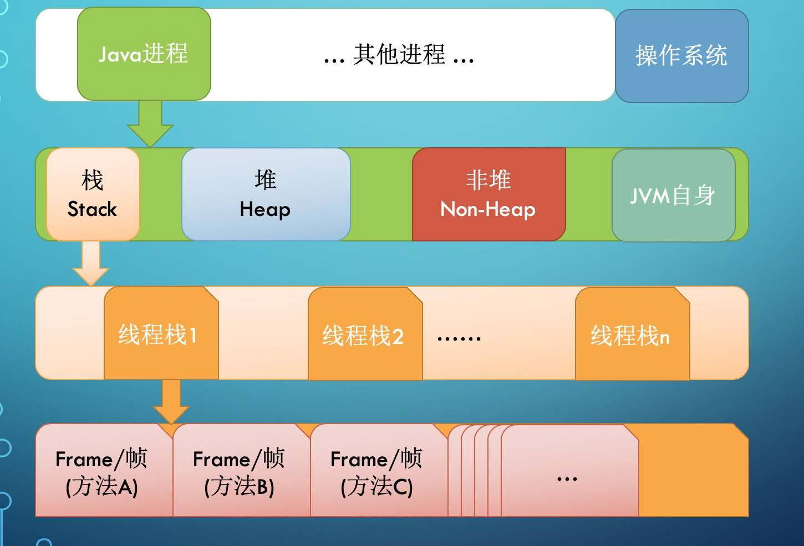

# 第一周 学习笔记 JVM核心技术
## 1.基础知识
Java 是一种面向对象、静态类型、编译执行，有VM/GC 和运行时、跨平台的高级语言。
## 2.Java 字节码技术
Java bytecode 由单字节（byte）的指令组成，理论上最多支持256 个操作码（opcode）。
实际上Java 只使用了200左右的操作码， 还有一些操作码则保留给调试操作。
根据指令的性质，主要分为四个大类：
1. 栈操作指令，包括与局部变量交互的指令
2. 程序流程控制指令
3. 对象操作指令，包括方法调用指令
4. 算术运算以及类型转换指令
编译
 javac xxx.java
 javac -g xxx.java
查看字节码
 javap -c -verbose xxx
## 3.JVM 类加载器
#### 类的生命周期
1. 加载（Loading）：找Class 文件
2. 验证（Verification）：验证格式、依赖
3. 准备（Preparation）：静态字段、方法表
4. 解析（Resolution）：符号解析为引用
5. 初始化（Initialization）：构造器、静态变
量赋值、静态代码块
6. 使用（Using）
7. 卸载（Unloading）
#### 类的加载时机
1. 当虚拟机启动时，初始化用户指定的主类，就是启动执行的main 方法所在的类；
2. 当遇到用以新建目标类实例的new 指令时，初始化new 指令的目标类，就是new
一个类的时候要初始化；
3. 当遇到调用静态方法的指令时，初始化该静态方法所在的类；
4. 当遇到访问静态字段的指令时，初始化该静态字段所在的类；
5. 子类的初始化会触发父类的初始化；
6. 如果一个接口定义了default 方法，那么直接实现或者间接实现该接口的类的初始化，
会触发该接口的初始化；
7. 使用反射API 对某个类进行反射调用时，初始化这个类，其实跟前面一样，反射调用
要么是已经有实例了，要么是静态方法，都需要初始化；
8. 当初次调用MethodHandle 实例时，初始化该MethodHandle 指向的方法所在的
类。
#### 不会初始化（可能会加载）
1. 通过子类引用父类的静态字段，只会触发父类的初始化，而不会触发子类的初始化。
2. 定义对象数组，不会触发该类的初始化。
3. 常量在编译期间会存入调用类的常量池中，本质上并没有直接引用定义常量的类，不
会触发定义常量所在的类。
4. 通过类名获取Class 对象，不会触发类的初始化，Hello.class 不会让Hello 类初始
化。
5. 通过Class.forName 加载指定类时，如果指定参数initialize 为false 时，也不会触
发类初始化，其实这个参数是告诉虚拟机，是否要对类进行初始化。Class.forName
（“jvm.Hello”）默认会加载Hello 类。
6. 通过ClassLoader 默认的loadClass 方法，也不会触发初始化动作（加载了，但是
不初始化）。
#### 三类加载器
1. 启动类加载器（BootstrapClassLoader）
2. 扩展类加载器（ExtClassLoader）
3. 应用类加载器（AppClassLoader）
##### 加载器特点：
1. 双亲委托
2. 负责依赖
3. 缓存加载
## 4.JVM内存模型

## 5.JVM启动参数
#### 1. 系统属性参数
#### 2. 运行模式参数
#### 3. 堆内存设置参数
-Xmx, 指定最大堆内存。如-Xmx4g. 这只是限制了Heap 部分的最大值为4g。
这个内存不包括栈内存，也不包括堆外使用的内存。
 -Xms, 指定堆内存空间的初始大小。如-Xms4g。而且指定的内存大小，并不是操作系统实际分配的初始值，而是GC先规划好，用到才分配。专用服务
器上需要保持–Xms 和–Xmx 一致，否则应用刚启动可能就有好几个FullGC。
当两者配置不一致时，堆内存扩容可能会导致性能抖动。
 -Xmn, 等价于-XX:NewSize，使用G1 垃圾收集器不应该设置该选项，在其他的某些业务场景下可以设置。官方建议设置为-Xmx 的1/2 ~ 1/4.
 -XX：MaxPermSize=size, 这是JDK1.7 之前使用的。Java8 默认允许的Meta空间无限大，此参数无效。
 -XX：MaxMetaspaceSize=size, Java8 默认不限制Meta 空间, 一般不允许设置该选项。
 -XX：MaxDirectMemorySize=size，系统可以使用的最大堆外内存，这个参数跟-Dsun.nio.MaxDirectMemorySize 效果相同。
 -Xss, 设置每个线程栈的字节数，影响栈的深度。例如-Xss1m 指定线程栈为1MB，与-XX:ThreadStackSize=1m 等价
#### 4. GC 设置参数
-XX：+UseG1GC：使用G1 垃圾回收器
 -XX：+UseConcMarkSweepGC：使用CMS 垃圾回收器
 -XX：+UseSerialGC：使用串行垃圾回收器
 -XX：+UseParallelGC：使用并行垃圾回收器
 // Java 11+
 -XX：+UnlockExperimentalVMOptions -XX:+UseZGC
 // Java 12+
 -XX：+UnlockExperimentalVMOptions -XX:+UseShenandoahGC
#### 5. 分析诊断参数
#### 6. JavaAgent 参数